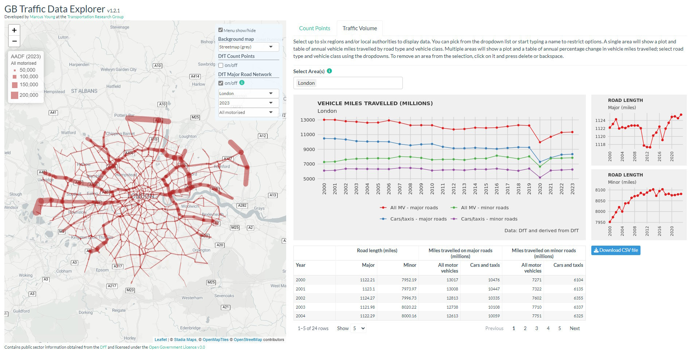

# GB Traffic Data Explorer

An R Shiny application to visually explore DfT traffic statistics for the whole of GB from 2000-2023, including count points, regional and local authority area summaries, and flows on major road links.

## Hosted version

The application is currently hosted on a virtual server provided by iSolutions at the University of Southampton. It can be accessed at https://trg-apps.soton.ac.uk/gbtraffic.

## Installation

### Obtaining DfT data

An [R script](https://github.com/solent-future-transport-zone/traffic-data-explorer/blob/main/dev/get_dft_data.R) is available to automatically download and process the DfT data. This script writes the processed data to a set of files in the `dev/dft_csv` folder. These files are later imported into the database (see below). Note that there may be changes to the DfT data in future years that require this script to be amended, for example the addition of new local authority areas.

### PostgreSQL database

This R Shiny application requires a backend PostgreSQL/PostGIS spatial database which contains imported data from DfT Road Traffic Statistics. Additional tables and views are derived from this data.

Steps required to create the database:

1. Create a spatial database.
2. Create a schema within the database called `traffic_gb` .
3. Create a database user/role called  `gbtraffic`. 
4. An [SQL script](https://github.com/solent-future-transport-zone/traffic-data-explorer/blob/main/dev/sql/setup_traffic_dft.sql) is available to create the database tables, import the DfT data, create necessary views, materialized views, and indexes,  and to set permissions for the `gbtraffic` user.


### Shiny Application

The application is provided as an R package. The required release of the R package should be uploaded to the Linux machine running Shiny Server as a tar.gz file.

Edit the file `/etc/R/Renviron.site` and add the following environment variables with the correct values for the PostgreSQL database, user and password:

```
GBTRAFFIC_PG_HOST = 'localhost'
GBTRAFFIC_PG_PORT = 5432
GBTRAFFIC_PG_DB = 'spatial'
GBTRAFFIC_PG_USER = 'gbtraffic'
GBTRAFFIC_PG_PASSWORD = 'blahblah'
STADIA_API_KEY = 'blahblah'
```

In the Linux terminal install the gbtraffic R package (uploaded earlier) as root (amend path as required):

```bash
sudo su - -c "R -e \"install.packages(c('/home/blah/file.tar.gz'), repos = NULL)\""
```

Or, alternatively:

```bash
sudo -i
Rscript -e 'install.packages("/home/blah/file.tar.gz", repos = NULL)'
```

A symlink needs to be created in the `/srv/shiny-server/` folder to the folder containing the app.R file. This file is in the folder `/inst/shinyApp` in the package prior to installation. After installation the contents of `/inst` are moved to top level of the package folder:

```
cd /srv/shiny-server/
sudo ln -s /usr/local/lib/R/site-library/gbtraffic/shinyApp ./trafficR
```

## Hosting

The above can be implemented fairly easily with a local installation of R and PostgreSQL. For a hosted solution expertise in setting up a virtual machine with R, Shiny Server and PostgreSQL/PostGIS installed will be required. It is recommended to use the [r2u](https://github.com/eddelbuettel/r2u) tool to install the required CRAN packages. This is fast and automatically resolves all OS dependencies.
